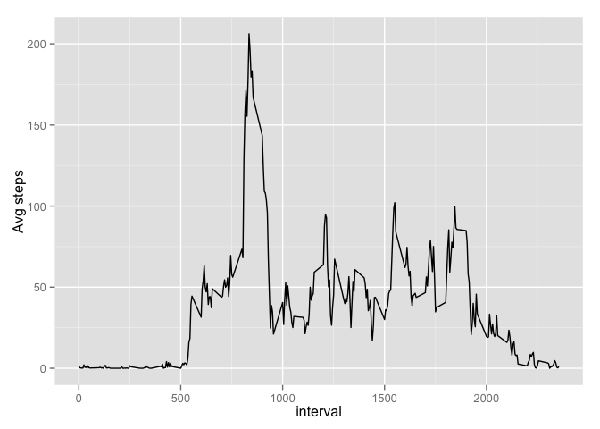
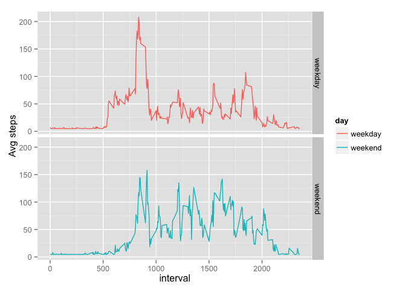

# Reproducible Research: Peer Assessment 1


## Loading and preprocessing the data
Read data from csv file.

```r
raw_data = read.csv("data/activity.csv")
summary(raw_data)
```

```
##      steps                date          interval     
##  Min.   :  0.00   2012-10-01:  288   Min.   :   0.0  
##  1st Qu.:  0.00   2012-10-02:  288   1st Qu.: 588.8  
##  Median :  0.00   2012-10-03:  288   Median :1177.5  
##  Mean   : 37.38   2012-10-04:  288   Mean   :1177.5  
##  3rd Qu.: 12.00   2012-10-05:  288   3rd Qu.:1766.2  
##  Max.   :806.00   2012-10-06:  288   Max.   :2355.0  
##  NA's   :2304     (Other)   :15840
```
Remove NA


```r
data = raw_data[complete.cases(raw_data),]
summary(data)
```

```
##      steps                date          interval     
##  Min.   :  0.00   2012-10-02:  288   Min.   :   0.0  
##  1st Qu.:  0.00   2012-10-03:  288   1st Qu.: 588.8  
##  Median :  0.00   2012-10-04:  288   Median :1177.5  
##  Mean   : 37.38   2012-10-05:  288   Mean   :1177.5  
##  3rd Qu.: 12.00   2012-10-06:  288   3rd Qu.:1766.2  
##  Max.   :806.00   2012-10-07:  288   Max.   :2355.0  
##                   (Other)   :13536
```

## What is mean total number of steps taken per day?

1) Histogram of the total number of steps taken each day

```r
steps_daily = aggregate(steps ~ date, data=data, sum)
hist(steps_daily$steps, xlab = "steps", main="Total number of steps each day")
```

 

2) Mean and median total number of steps taken per day

```r
mean(steps_daily$steps)
```

```
## [1] 10766.19
```

```r
median(steps_daily$steps)
```

```
## [1] 10765
```

## What is the average daily activity pattern?
1) Make a time series plot (i.e. type = "l") of the 5-minute interval (x-axis) and the average number of steps taken, averaged across all days (y-axis)


```r
# Calculate mean across date
avg_steps_int = aggregate(steps ~ interval, data=data, mean)

# Calculate max steps
max_step = max(avg_steps_int$steps)
max_idx = which(avg_steps_int$steps == max_step)

require("ggplot2")
```

```
## Loading required package: ggplot2
```

```r
ggplot(data = avg_steps_int) + 
  geom_line(aes(x = interval, y = steps)) + xlab("interval") + ylab("Avg steps") 
```

 

2) Which 5-minute interval, on average across all the days in the dataset, contains the maximum number of steps?

```r
avg_steps_int[max_idx,]
```

```
##     interval    steps
## 104      835 206.1698
```

## Imputing missing values

1) The total number of missing values in the dataset

```r
na_idx = which(!complete.cases(raw_data))
length(na_idx)
```

```
## [1] 2304
```

2) Devise a strategy for filling in all of the missing values in the dataset. The strategy does not need to be sophisticated. For example, you could use the mean/median for that day, or the mean for that 5-minute interval, etc.

We can replace all NA values with mean of steps per day

```r
avg_steps = mean(data$steps)
avg_steps
```

```
## [1] 37.3826
```

3) Create a new dataset that is equal to the original dataset but with the missing data filled in.

```r
fill_data = raw_data
fill_data$steps[na_idx] = avg_steps
summary(fill_data)
```

```
##      steps                date          interval     
##  Min.   :  0.00   2012-10-01:  288   Min.   :   0.0  
##  1st Qu.:  0.00   2012-10-02:  288   1st Qu.: 588.8  
##  Median :  0.00   2012-10-03:  288   Median :1177.5  
##  Mean   : 37.38   2012-10-04:  288   Mean   :1177.5  
##  3rd Qu.: 37.38   2012-10-05:  288   3rd Qu.:1766.2  
##  Max.   :806.00   2012-10-06:  288   Max.   :2355.0  
##                   (Other)   :15840
```

4) Make a histogram of the total number of steps taken each day and Calculate and report the mean and median total number of steps taken per day. Do these values differ from the estimates from the first part of the assignment? What is the impact of imputing missing data on the estimates of the total daily number of steps?

```r
fill_steps_daily = aggregate(steps ~ date, data=fill_data, sum)
hist(fill_steps_daily$steps, xlab = "steps", main="Total number of steps each day (NA filled)")
```

 

The median of data is changed but mean remain the same. Histogram shows that data distribution is more skewed at the center.

```r
mean(fill_steps_daily$steps)
```

```
## [1] 10766.19
```

```r
median(fill_steps_daily$steps)
```

```
## [1] 10766.19
```

## Are there differences in activity patterns between weekdays and weekends?

Split data

```r
factor.weekend <- function(dates) {
    dates = weekdays(as.Date(dates, format='%Y-%m-%d'))
    idx = which(dates == "Saturday" | dates == "Sunday")
    dates = rep("weekday", length(dates))
    dates[idx] = "weekend"
    dates
}
```
Plot average steps between weekday and weekend shows that steps in weekday is much higher in the morning that weekend. 

```r
day = factor.weekend(fill_data$date)
fill_data = cbind(fill_data, day)
avg_step_wk = aggregate(steps ~ interval + day, data=fill_data, mean)

ggplot(data = avg_step_wk) + 
    geom_line(aes(x = interval, y = steps, color=day)) + 
    xlab("interval") + ylab("Avg steps") + facet_grid(day ~ .)
```

 


